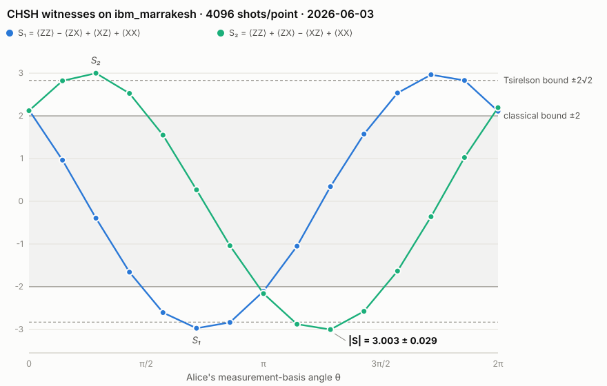

# claude-quantum

**A vibe-coded Bell test — real quantum hardware, real entanglement, |S| = 3.003 ± 0.029, a 34.8σ violation of the classical bound.**

This repository contains a complete quantum-physics experiment in which **every line of code was written by an AI**. The project was conceived, designed, and orchestrated by **Abe Caplan**, with design and execution supported by **Claude** (Anthropic). On June 3, 2026, it ran the CHSH Bell-inequality test on [`ibm_marrakesh`](https://quantum.cloud.ibm.com/), a 156-qubit IBM Quantum *Heron r2* processor, and measured a Bell-inequality violation of **34.79 standard deviations** — the same class of experiment that won the [2022 Nobel Prize in Physics](https://www.nobelprize.org/prizes/physics/2022/press-release/) — using **79 seconds** of quantum-processor time, at zero cost, on hardware accessed over the public internet.

The first experiment of this kind, in 1972, took 200 hours of data collection in a Berkeley basement. This one took 79 seconds, and the code that designed, gated, executed, and verified it was written entirely through natural-language conversation. That contrast — in both physics access and software methodology — is what this project is about.

<picture>
  <source media="(prefers-color-scheme: dark)" srcset="results/chsh_curve_dark.svg">
  
</picture>

*Both CHSH witnesses swept over Alice's measurement-basis angle θ (15 points, 4096 shots each). Every point in the shaded band is classically explainable; the lobes outside it are not. Error bars (±1σ ≈ 0.03) are smaller than the markers. Points beyond the ±2√2 line are a readout-mitigation artifact, explained below.*

## The result

| | |
|---|---|
| **Peak CHSH value** | \|S\| = **3.003 ± 0.029** (witness S₂ at θ = 1.286π) |
| **Violation of classical bound (\|S\| ≤ 2)** | **34.79σ** |
| **Backend** | `ibm_marrakesh` — IBM Heron r2, 156 qubits (job `d8ft3vbo3njc73f0qm00`) |
| **QPU time billed** | 79 s (~1.3 min of the free Open Plan's 10-min monthly budget) |
| **Settings** | 4096 shots/point · resilience level 1 (readout mitigation) · dynamical decoupling (XX) · measurement twirling |
| **Software** | Qiskit 2.4.1 · qiskit-ibm-runtime 0.47.0 |

Raw data: [`results/chsh.json`](results/chsh.json) · full per-point log: [`results/run_log_phase1.md`](results/run_log_phase1.md) · figure source: [`analysis/plot_chsh.py`](analysis/plot_chsh.py)

## The physics, from zero

*This section assumes no physics background beyond comfort with the idea of measuring something and getting +1 or −1. It is precise — nothing below is a lie-to-children — just compressed.*

### 1. Entanglement, and Einstein's objection

A qubit is a physical system with two measurable states, written |0⟩ and |1⟩. Quantum mechanics allows two qubits to be prepared in the **entangled state**

$$|\Phi^+\rangle = \tfrac{1}{\sqrt{2}}\left(|00\rangle + |11\rangle\right)$$

which has a strange property: the *pair* is in a perfectly definite state, but *neither qubit individually* is. Measure both qubits the same way and you get the same answer every time — both 0 or both 1, at random, no matter how far apart they are.

Perfect correlation alone is not spooky. Two sealed envelopes containing matching letters would do the same: the answers were fixed all along, you just didn't know them. Einstein believed something like this had to be the truth — that quantum particles carry hidden "instruction lists" fixing every measurement outcome in advance ("**realism**"), and that nothing you do to one particle can instantaneously affect the other ("**locality**"). His famous complaint that quantum mechanics seemed to involve *"spooky action at a distance"* comes from the [1935 Einstein–Podolsky–Rosen paper](https://journals.aps.org/pr/abstract/10.1103/PhysRev.47.777) arguing quantum mechanics must be an incomplete description, to be completed by such **local hidden variables**.

For thirty years this was considered philosophy — untestable in principle.

### 2. Bell's theorem: philosophy becomes arithmetic

In 1964, [John Bell proved](https://cds.cern.ch/record/111654) it *is* testable. Suppose Alice and Bob each hold one qubit of a pair. Alice measures with one of two settings, *a* or *a′*; Bob with *b* or *b′*. Every measurement returns +1 or −1. Define the correlation E(a, b) as the average of the product of their outcomes, and combine four of them ([Clauser–Horne–Shimony–Holt, 1969](https://journals.aps.org/prl/abstract/10.1103/PhysRevLett.23.880)):

$$S = E(a,b) - E(a,b') + E(a',b) + E(a',b')$$

If the outcomes are fixed in advance by *any* hidden instruction lists (any at all — Bell's argument doesn't care about the mechanism), then in every single run the four predetermined values ±1 must satisfy a(b−b′) + a′(b+b′) = ±2, because one parenthesis is always zero and the other ±2. Averaging over runs:

$$|S| \le 2 \qquad \text{for every local hidden-variable theory.}$$

Quantum mechanics predicts that entangled qubits, measured in bases tilted 45° apart, reach

$$|S| = 2\sqrt{2} \approx 2.828 \qquad \text{(the Tsirelson bound).}$$

That gap — between 2 and 2.828 — is where the metaphysics gets settled by counting. Measure |S| > 2 and *every possible* local hidden-variable explanation is ruled out in one shot.

### 3. What this experiment actually did

- **Prepare** the Bell state on two superconducting qubits: a Hadamard gate on qubit 0, then a CNOT ([`experiments/_common.py`](experiments/_common.py)). Circuit depth after compilation to native hardware gates: 8.
- **Sweep** Alice's measurement basis: an RY(θ) rotation on qubit 0, with θ stepped through 15 values from 0 to 2π. Rather than four fixed settings, the sweep traces the *entire correlation curve* — a much stricter comparison against theory than a single number.
- **Measure** the four correlators ⟨ZZ⟩, ⟨ZX⟩, ⟨XZ⟩, ⟨XX⟩ at each θ (Z = the computational basis, X = a basis rotated 90°; 4096 shots per point) and combine them into two CHSH witnesses, S₁ and S₂, which peak at complementary angles.
- **Predict** (exactly, by independent simulation): both witnesses trace sinusoids, |S| touching 2√2 at odd multiples of π/4, and S₁(0) = 2 — the largest value classical correlations can reach, exactly at the boundary, where the qubits are measured in identical bases and the envelope analogy still works.
- **Observe**: the measured curves match the predicted sinusoids point-for-point, and the peak sits at **|S| = 3.003 ± 0.029**, thirty-four standard deviations beyond anything hidden instruction lists can produce.

### 4. Two honesty notes, before anyone gets excited

**3.003 exceeds 2.828 — did the chip beat quantum mechanics?** No. The run used IBM's readout-error mitigation (resilience level 1), which corrects for the ~1.2–1.3% chance of misreading each qubit by *extrapolating* what a perfect readout would have seen. Extrapolation overshoots: several mitigated points land slightly past the Tsirelson bound. The raw, unmitigated data would sit at or below 2.828. This is a well-understood artifact, it is flagged in the [run log](results/run_log_phase1.md), and probing it directly (mitigated vs. raw) is planned as a future phase.

**Does this refute local realism?** Not by itself. The two qubits sit a fraction of a millimetre apart on the same chip, so a signal moving at light speed could easily cross between them during a measurement — the **locality loophole** is wide open, along with others. Genuinely loophole-free Bell tests required heroic engineering: electron spins [1.3 km apart in Delft (2015)](https://pubmed.ncbi.nlm.nih.gov/26503041/), photon experiments [at NIST and Vienna the same year](https://en.wikipedia.org/wiki/Bell_test), and for superconducting qubits — this hardware family — a [30-meter cryogenic link at ETH Zurich (2023)](https://www.nature.com/articles/s41586-023-05885-0). What this experiment demonstrates is different and still substantive: that a publicly accessible quantum computer produces, on demand, the entanglement correlations that local realism forbids — and that the full experimental pipeline around that fact can now be built by an AI in an afternoon.

## How it compares

The 2022 Nobel Prize in Physics went to John Clauser, Alain Aspect, and Anton Zeilinger *"for experiments with entangled photons, establishing the violation of Bell inequalities and pioneering quantum information science."* This project is a direct descendant of the first two laureates' experiments — same inequality, same question:

| Year | Experiment | Result | What it took |
|---|---|---|---|
| 1972 | [Freedman & Clauser](https://journals.aps.org/prl/abstract/10.1103/PhysRevLett.28.938), Berkeley — first Bell test ever | violation by ~6σ | 200 hours of data; calcium atomic beam; hand-built polarizers |
| 1982 | [Aspect, Grangier & Roger](https://journals.aps.org/prl/abstract/10.1103/PhysRevLett.49.91), Orsay | S = 2.697 ± 0.015 (~40σ) | years of custom laser/optics engineering |
| 2015 | [Hensen et al.](https://pubmed.ncbi.nlm.nih.gov/26503041/), Delft — first loophole-free test | S = 2.42 ± 0.20 | electron spins in diamonds 1.3 km apart |
| 2023 | [Storz et al.](https://www.nature.com/articles/s41586-023-05885-0), ETH Zurich — loophole-free, superconducting | S = 2.0747 ± 0.0033 | 30 m cryogenic quantum link |
| 2026 | **this repo** — AI-written, consumer-grade access | \|S\| = 3.003 ± 0.029* (34.8σ) | 79 s of free QPU time; zero hardware touched |

\* *mitigated value; see honesty notes above. The comparison is not of scientific weight — the earlier entries closed loopholes and settled a foundational question; this entry inherits their answer. The comparison is of* access: *what once required a national laboratory now requires a free account and a well-checked script.*

## How it was built: vibe-coded, but gated

The entire codebase — circuit construction, hardware orchestration, analysis, verification, plotting, and this documentation — was written by Claude through conversational direction, without hand-written code. "Vibe coding" has a reputation for producing software that *looks* right rather than *is* right. For a physics experiment that spends a nonrefundable hardware budget and makes a checkable scientific claim, looking right is worthless. So the project was run under strict protocols, designed in collaboration between Abe Caplan and Claude before any hardware was touched:

1. **Physics first, SDK second.** The circuit and observables were fixed by exact mathematics and treated as immutable; every quantum-SDK call was treated as provisional and version-sensitive. Correctness lives in the physics check, never in "the API call didn't error."
2. **A hard simulator gate.** Hardware execution was locked behind a noiseless-simulation gate ([`exp1_chsh.py --sim`](experiments/exp1_chsh.py)): the sweep must reproduce the theoretical curve — peak |S| within [2.80, 2.85] on the 15-point grid, peak at a correct lobe, S₁(0) ≈ 2 — before the `--hardware` path may be run. If the gate fails, the script exits and hardware stays locked.
3. **Independent verification.** [`analysis/verify.py`](analysis/verify.py) deliberately trusts nothing from the experiment code: it re-derives the expected physics from scratch in pure NumPy — its own gate matrices, its own qubit-ordering conventions — and checks the recorded results against that independent derivation, point by point.
4. **Budget guards in code.** Shot counts capped (the script *refuses* > 4096), sweep trimmed to 15 points, single-job execution mode — so no bug could burn the 10-minute monthly quota. Actual spend: 79 s.
5. **Credential hygiene.** No token ever appears in code or committed files; credentials come from the environment or a locally saved account only.
6. **Results as a contract.** Every run writes one schema-stable JSON ([`results/chsh.json`](results/chsh.json)); analysis and plotting read only the JSON, never the live run. The recorded artifact *is* the experiment.
7. **Honest reporting.** The mitigation overshoot past 2.828 is documented as an artifact, not spun as a discovery.

The interesting methodological claim is not "an AI can write Qiskit code" — it is that **the gating discipline, not the code generation, is what made the result trustworthy**, and that discipline is itself specifiable in natural language.

## Repository layout

| Path | What it is |
|---|---|
| [`experiments/_common.py`](experiments/_common.py) | Shared physics (circuit, observables) + IBM Runtime plumbing, with the Open-Plan rules encoded |
| [`experiments/exp1_chsh.py`](experiments/exp1_chsh.py) | The experiment: `--sim` gate path and `--hardware` path, same JSON schema out |
| [`analysis/verify.py`](analysis/verify.py) | Independent from-scratch verifier for recorded results |
| [`analysis/plot_chsh.py`](analysis/plot_chsh.py) | Renders the figure above from the JSON |
| [`results/chsh.json`](results/chsh.json) | The hardware run record (the artifact of scientific interest) |
| [`results/run_log_phase1.md`](results/run_log_phase1.md) | Full run log: job metadata, calibration snapshot, per-point table |
| [`docs/index.html`](docs/index.html) | Self-contained landing page telling this story interactively |

## Reproduce it

The simulation path is free, offline, and verifies the whole construction:

```bash
pip install -r requirements.txt
python experiments/exp1_chsh.py --sim --out results/chsh_sim.json   # runs the correctness gate
python analysis/verify.py results/chsh_sim.json                     # independent check
```

To rerun on real hardware you need a free [IBM Quantum](https://quantum.cloud.ibm.com/) account (Open Plan, 10 min QPU/month). Save your credentials locally per IBM's docs (or export `IBM_TOKEN` / `IBM_CRN`), then — only after the sim gate passes:

```bash
python experiments/exp1_chsh.py --hardware    # ~80 s of QPU time
python analysis/plot_chsh.py                  # regenerate the figure from your run
```

## What's next

- **More entanglement.** A follow-on project scaling from 2 entangled qubits to many — GHZ-class states, where the gap between quantum prediction and classical explanation grows exponentially with qubit count.
- **The mitigation study.** A dedicated raw-vs-mitigated comparison of the Tsirelson overshoot documented above.
- **An open-source modular framework for vibe-coded quantum experiments** — generalizing the pattern that worked here (physics fixed by independent simulation → hard sim gate → budget-guarded hardware run → schema-stable results → independent verifier) into a reusable scaffold others can point at their own experiments.

## References

1. A. Einstein, B. Podolsky, N. Rosen, [*Can Quantum-Mechanical Description of Physical Reality Be Considered Complete?*](https://journals.aps.org/pr/abstract/10.1103/PhysRev.47.777), Phys. Rev. **47**, 777 (1935)
2. J. S. Bell, [*On the Einstein Podolsky Rosen Paradox*](https://cds.cern.ch/record/111654), Physics **1**, 195 (1964)
3. J. F. Clauser, M. A. Horne, A. Shimony, R. A. Holt, [*Proposed Experiment to Test Local Hidden-Variable Theories*](https://journals.aps.org/prl/abstract/10.1103/PhysRevLett.23.880), Phys. Rev. Lett. **23**, 880 (1969)
4. S. J. Freedman, J. F. Clauser, [*Experimental Test of Local Hidden-Variable Theories*](https://journals.aps.org/prl/abstract/10.1103/PhysRevLett.28.938), Phys. Rev. Lett. **28**, 938 (1972)
5. A. Aspect, P. Grangier, G. Roger, [*Experimental Realization of Einstein-Podolsky-Rosen-Bohm Gedankenexperiment*](https://journals.aps.org/prl/abstract/10.1103/PhysRevLett.49.91), Phys. Rev. Lett. **49**, 91 (1982)
6. B. Hensen et al., [*Loophole-free Bell inequality violation using electron spins separated by 1.3 kilometres*](https://pubmed.ncbi.nlm.nih.gov/26503041/), Nature **526**, 682 (2015)
7. S. Storz et al., [*Loophole-free Bell inequality violation with superconducting circuits*](https://www.nature.com/articles/s41586-023-05885-0), Nature **617**, 265 (2023)
8. [The Nobel Prize in Physics 2022](https://www.nobelprize.org/prizes/physics/2022/press-release/) — Aspect, Clauser, Zeilinger
9. [IBM Quantum: CHSH inequality tutorial](https://quantum.cloud.ibm.com/docs/en/tutorials/chsh-inequality) — the canonical pattern this experiment's hardware path follows

---

*Conceived, designed, and orchestrated by Abe Caplan. Design and execution supported by Claude (Anthropic). MIT License.*
